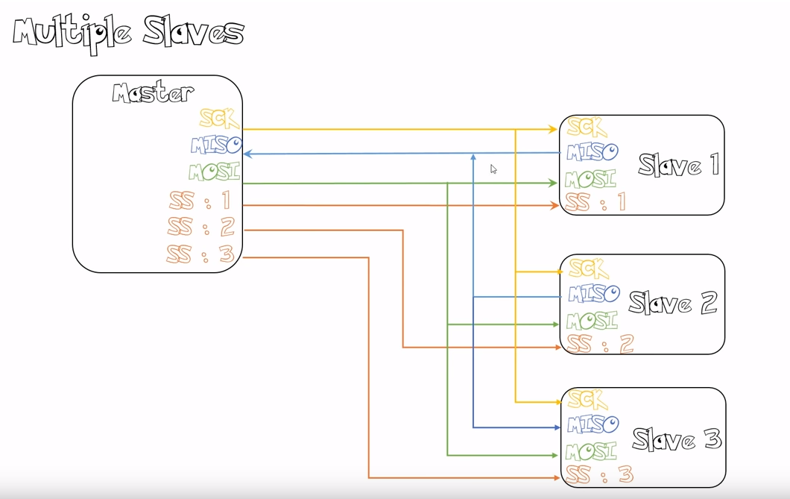
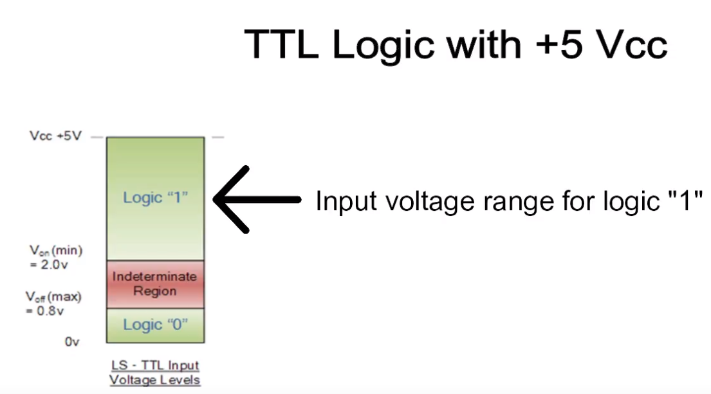

# Note on Embedded Systems
# Serial Protocols

 

# UART (Universal Asynchronous Receiver Transmitter)

Most controllers have a hardware UART on board. It uses a single data line for transmitting and one for receiving data. Most often 8-bit data is transferred, as follows: 1 start bit (low level), 8 data bits and 1 stop bit (high level). The low level start bit and high level stop bit mean that there's always a high to low transition to start the communication. That's what describes UART. No voltage level, so you can have it at 3.3 V or 5 V, whichever your microcontroller uses. Note that the microcontrollers which want to communicate via UART have to agree on the transmission speed, the bit-rate, as they only have the start bits falling edge to synchronize. That's called asynchronous communication.
The timing dependency is one of the big drawbacks of UART, and the solution is USART, for Universal Synchronous/Asynchronous Receiver Transmitter. This can do UART, but also a synchronous protocol. In synchronous there's not only data, but also a clock transmitted. With each bit a clock pulse tells the receiver it should latch that bit. Synchronous protocols either need a higher bandwidth, like in the case of Manchester encoding, or an extra wire for the clock, like SPI and I2C.

 

# SPI (Serial Peripheral Interface)

A master sends a clock signal, and upon each clock pulse it shifts one bit out to the slave, and one bit in, coming from the slave. Signal names are therefore SCK for clock, MOSI for Master Out Slave In, and MISO for Master In Slave Out. By using SS (Slave Select) signals the master can control more than one slave on the bus. There are two ways to connect multiple slave devices to one master, one is mentioned above i.e. using slave select, and other is daisy chaining, it uses fewer hardware pins (select lines), but software gets complicated.

## SPI example

## Configurations
There are two types of configuration for multiple slaves:

# I2C (Inter-Integrated Circuit, I squared C)

is also a synchronous protocol, and it's the first we see which has some "intelligence" in it; the other ones dumbly shifted bits in and out, and that was that. I2C uses only 2 wires, one for the clock (SCL) and one for the data (SDA). That means that master and slave send data over the same wire, again controlled by the master who creates the clock signal. I2C doesn't use separate Slave Selects to select a particular device, but has addressing. The first byte sent by the master holds a 7 bit address (so that you can use 127 devices on the bus) and a read/write bit, indicating whether the next byte(s) will also come from the master or should come from the slave. After each byte, the receiver must send a "0" to acknowledge the reception of the byte, which the master latches with a 9th clock pulse. If the master wants to write a byte, the same process repeats: the master puts bit after bit on the bus and each time gives a clock pulse to signal that the data is ready to be read. If the master wants to receive data it only generates the clock pulses. The slave has to take care that the next bit is ready when the clock pulse is given. This protocol is patented by NXP (formerly Phillips), to save licensing cost, Atmel using the word TWI (2-wire interface) which exactly same as I2C, so any AVR device will not have I2C but it will have TWI.

Two or more signals on the same wire may cause conflicts, and you would have a problem if one device sends a "1" while the other sends a "0". Therefore the bus is wired-OR'd: two resistors pull the bus to a high level, and the devices only send low levels. If they want to send a high level they simply release the bus.

 
 

# Pull-up/Pull-down Resistors

## The problem

Pull-up and Pull-down resistors are used to correctly bias the inputs of digital gates to stop them from floating about randomly when there is no input condition.
If the inputs to a digital logic gate or circuit are not within the range by which it can be sensed as either a logic “0” or a logic “1” input, then the digital circuit may false trigger as the gate or circuit does not recognise the correct input value, as the HIGH may not be high enough or the LOW may not be low enough.
We can easily avoid this problem using Pull-up Resistors and Pull-down Resistors to give the input pin a defined default state, even if the switch is open, closed or there is nothing is connected to it.

## Floating state 

## Pull up resistor (open  "1")

## Pull up resistor (close "0")

## Pull down resistor (close  "1")

## Pull down resistor (open "0")

     

# DMA (Direct Memory Access)

# Description

The CPU prepares the DMA-operation by the construction of a descriptor (1), containing all necessary information for the DMAC to independently perform the DMA-operation (offload engine for data transfer). It initalizes the operation by writing a command to a register in the DMAC (2a) or to a special assigned memory area (command area), where the DMAC can poll for the command and/or the descriptor (2b). Then the DMAC addresses the device data register (3) and read the data into a temporary data register (4). In another bus transfer cycle, it addresses the memory block (5) and writes the data from the temporary data register to the memory block (6).

 
The DMAC increments the memory block address and continue with this loop until the block length is reached. The completion of the DMAoperation is signaled to the processor by sending an IRQ signal or by setting a memory semaphore variable, which can be tested by the CPU.
DMA control signals (REQ, ACK) are used to signal the availability of values in the I/Odevice for transportation. DMAC is using bus bandwidth which may slow down processor execution by bus conflicts (solution for high  erformance systems: use xbar as interconnect!)For all communication function it is important to know, when an operation is completed. Signalling this event to the ’process being interested’ in this information is very difficult. The most common way is to throw an interrupt, which stops normal processing of a CPU and activates the interrupt handler. Beside the fact that interrupt processing has speed up significantly in the last years, it need to save the CPU state and in the newest processors the register file is larger than ever.

# Briefly explanation

1. CPU set the register of DMA Controller to perform the operation that we want to do.

2. CPU ask to disk controller to read the data to the Drivce and to store these on his buffer. After that DMA controller ask to disk controller to transfer data from the buffer to the memory.

3. The disk controller transfer data to the memory.

4. After that data were transferred  the disk controller send aknowledge  to the DMA controller to tell him that the data were correctly tranferred.
After that count decrease. If count  go is different from "0" the 2) and 3) operations go in loop, if not and interrupt was sent to the CPU.